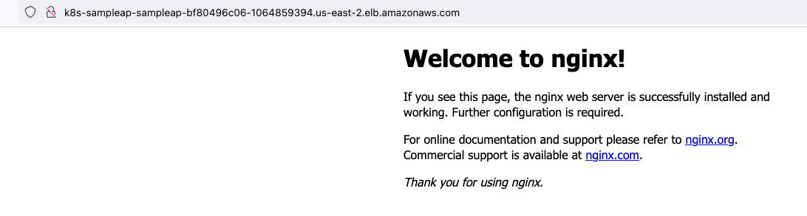

## Deploy sample application and Create a Load Balancer Using Terraform to EKS Cluster. 

### Prerequisite

Before we proceed and deploy the sample application using Terraform, there are a few commands or tools you need to have in the server where you will be creating the cluster from.

    1. awscli - aws-cli/2.12.1 Python/3.11.3

    2. go version go1.18.9 linux/amd64

    3. Terraform v1.5.0

    4. kubectl - Client Version: v1.23.17-eks

    5. helm - v3.8.0

### Assumptions

The following details makes the following assumptions.

    You have aws cli configured

    You have created s3 bucket that will act as the backend of the project. 

You have setup the EKS cluster as described in this project [Setting up EKS Cluster with Terraform, Helm and a Load balancer](https://github.com/Skanyi/terraform-projects/tree/main/eks)

## Quick Setup

Clone the repository:

    git clone https://github.com/Skanyi/terraform-projects.git

Change directory;

    cd applications/sample-application-nginx

Update the `backend.tf` and update the s3 bucket and the region of your s3 bucket. Update the profile if you are not using the default profile. 

Update the `variables.tf` profile variable if you are not using the default profile. 

Update the `secret.tfvars` file with the output values of the [Setting up EKS with Terraform, Helm and a Load balance]()

Format the the project

    terraform fmt

Initialize the project to pull all the moduels used

    terraform init

Validate that the project is correctly setup. 

    terraform validate

Run the plan command to see all the resources that will be created

    terraform plan --var-file="secret.tfvars

When you ready, run the apply command to create the resources. 

    terraform apply --var-file="secret.tfvars


## Detailed Setup Steps. 

When the above setup is done, we are now ready to deploy a sample application to test if everything is working as expected. In this step, we are going to create the following:

1. Namespace - Create a namespace where we are going to deploy the sample application.

    ```
    resource "kubernetes_namespace" "sample-application-namespace" {
    metadata {
        annotations = {
        name = "sample-application"
        }

        labels = {
        application = "sample-nginx-application"
        }

        name = "sample-application"
    }
    ```

2. Policy - Create a policy that we are going to attache to the role that the sample application is going to use.

    ```
    module "sample_application_iam_policy" {
    source = "terraform-aws-modules/iam/aws//modules/iam-policy"

    name        = "${var.env_name}_sample_application_policy"
    path        = "/"
    description = "sample Application Policy"

    policy = <<EOF
    {
    "Version": "2012-10-17",
    "Statement": [
        {
        "Action": [
            "ec2:Describe*"
        ],
        "Effect": "Allow",
        "Resource": "*"
        }
    ]
    }
    EOF
    }
    ```

3. Role - Create a role that we are going to annotate the Service Account used by the sample application with.

    ```
    module "sample_application_role" {
    source = "terraform-aws-modules/iam/aws//modules/iam-role-for-service-accounts-eks"

    role_name = "${var.env_name}_sample_application"
    role_policy_arns = {
        policy = module.sample_application_iam_policy.arn
    }

    oidc_providers = {
        main = {
        provider_arn               = var.oidc_provider_arn
        namespace_service_accounts = ["sample-application:sample-application-sa"]
        }
    }
    }
    ```

4. Service Account - Create a service account that the Sample application is going to use to get access to different AWS services. 

    ```
    resource "kubernetes_service_account" "service-account" {
    metadata {
        name      = "sample-application-sa"
        namespace = kubernetes_namespace.sample-application-namespace.metadata[0].name
        labels = {
        "app.kubernetes.io/name" = "sample-application-sa"
        }
        annotations = {
        "eks.amazonaws.com/role-arn"               = module.sample_application_role.iam_role_arn
        "eks.amazonaws.com/sts-regional-endpoints" = "true"
        }
    }
    }
    ```

5. Deployment - We create a simple deplyment using resource "kubernetes_deployment_v1" and nginx as the image for our container. 

    ```
    resource "kubernetes_deployment_v1" "sample_application_deployment" {
    metadata {
        name      = "sample-application-deployment"
        namespace = kubernetes_namespace.sample-application-namespace.metadata[0].name
        labels = {
        app = "nginx"
        }
    }

    spec {
        replicas = 2

        selector {
        match_labels = {
            app = "nginx"
        }
        }

        template {
        metadata {
            labels = {
            app = "nginx"
            }
        }

        spec {
            service_account_name = kubernetes_service_account.service-account.metadata[0].name
            container {
            image = "nginx:1.21.6"
            name  = "nginx"

            resources {
                limits = {
                cpu    = "0.5"
                memory = "512Mi"
                }
                requests = {
                cpu    = "250m"
                memory = "50Mi"
                }
            }

            liveness_probe {
                http_get {
                path = "/"
                port = 80

                http_header {
                    name  = "X-Custom-Header"
                    value = "Awesome"
                }
                }

                initial_delay_seconds = 3
                period_seconds        = 3
            }
            }
        }
        }
    }
    }
    ```

6. Serivice - We create a simple service that exposes the above deployment. 

    ```
    resource "kubernetes_service_v1" "sample_application_svc" {
    metadata {
        name      = "sample-application-svc"
        namespace = kubernetes_namespace.sample-application-namespace.metadata[0].name
    }
    spec {
        selector = {
        app = "nginx"
        }
        session_affinity = "ClientIP"
        port {
        port        = 80
        target_port = 80
        }

        type = "NodePort"
    }
    }
    ```

7. Ingress - Finally we create an ingress that will be used to create the application load balancer 

    ```
    resource "kubernetes_ingress_v1" "sample_application_ingress" {
    metadata {
        name      = "sample-application-ingress"
        namespace = kubernetes_namespace.sample-application-namespace.metadata[0].name
        annotations = {
        "alb.ingress.kubernetes.io/scheme" = "internet-facing"
        }
    }

    wait_for_load_balancer = "true"

    spec {
        ingress_class_name = "alb"
        default_backend {
        service {
            name = "sample-application-svc"
            port {
            number = 80
            }
        }
        }

        rule {
        http {
            path {
            backend {
                service {
                name = "sample-application-svc"
                port {
                    number = 80
                }
                }
            }

            path = "/app1/*"
            }

        }
        }

        tls {
        secret_name = "tls-secret"
        }
    }
    }
    ```

When the above is done, use the following commands to confirm if the ingress was created succesfully.

    kubectl get ingress -n sample-application

Access the application on the browser using the application load balancer address shown from by the above command. 



## Cleanup the Resources we Created

When we are done testing the setup and don’t require the resources created anymore, we can use the steps below to remove them.

    1.1 terraform init

    1.2 terraform destroy

## Next Steps

I will be adding monitoring using Prometheus and Grafana 
